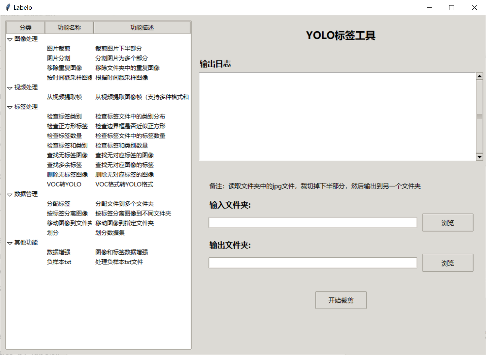
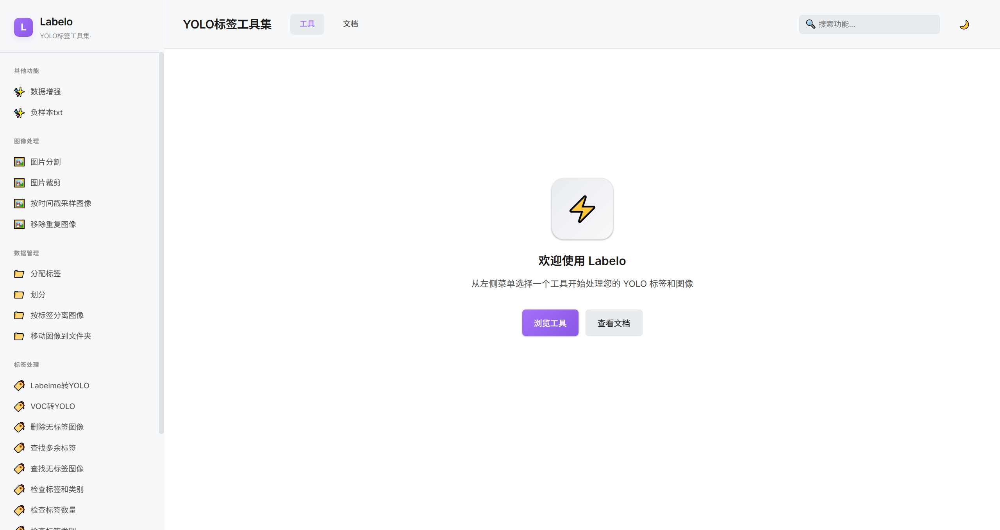
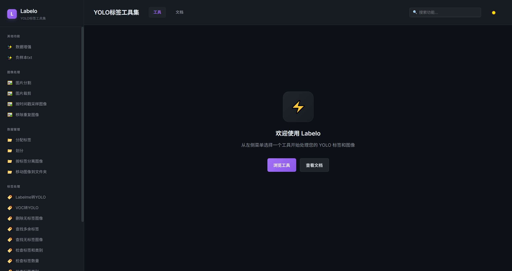

# Labelo - YOLO标签工具集

一个用于YOLO目标检测数据集处理的一站式工具集，提供可视化界面和丰富的图像处理、标签处理功能。

## 项目特点

- 🎨 **双界面支持**: 传统GUI界面和现代Web界面
- 🌙 **主题切换**: 支持深色模式和浅色模式
- 📁 **丰富的工具集**: 涵盖图像处理、视频处理、标签处理和数据管理
- 🚀 **易于使用**: 直观的用户界面和详细的文档
- 🔧 **命令行支持**: 所有工具都可以通过命令行单独使用

## 功能特性

### 图像处理
- **图片裁剪**: 裁剪图片的下半部分
- **图片分割**: 将图片分割为多个部分
- **移除重复图像**: 移除文件夹中的重复图像
- **按时间戳采样图像**: 根据时间戳采样图像

### 视频处理
- **从视频提取帧**: 从视频文件中提取图像帧
- **视频转图像**: 将视频文件转换为图像序列

### 标签处理
- **检查标签类别**: 检查标签文件中的类别分布
- **检查正方形标签**: 检查边界框是否近似正方形
- **检查标签数量**: 检查标签文件中的标签数量
- **检查标签和类别**: 检查标签和类别数量
- **查找无标签图像**: 查找没有对应标签文件的图像
- **查找多余标签**: 查找没有对应图像的标签文件
- **删除无标签图像**: 删除没有对应标签文件的图像
- **VOC转YOLO**: 将VOC格式标签转换为YOLO格式
- **LabelMe转YOLO**: 将LabelMe JSON格式转换为YOLO TXT格式

### 数据管理
- **分配标签**: 将标签文件分配给多个人标注
- **按标签分离图像**: 将图像按是否有标签分离到不同文件夹
- **移动图像到文件夹**: 将图像移动到指定文件夹
- **划分**: 划分数据集
- **数据增强**: 对图像和标签进行数据增强
- **负样本txt**: 处理负样本txt文件

## 界面展示

### 传统GUI界面



### Web界面 - 浅色模式



### Web界面 - 深色模式



## 安装说明

### 环境要求
- Python 3.7+
- Tkinter (通常随Python一起安装)
- OpenCV
- NumPy
- Flask (Web界面需要)

### 安装依赖
```bash
pip install opencv-python numpy flask
```

## 使用方法

### 传统GUI界面
```bash
python main.py
```

### Web界面
```bash
python web_app.py
```

然后在浏览器中访问 http://127.0.0.1:5000

### 命令行工具
每个工具都可以单独使用命令行方式运行，例如：

```bash
# LabelMe转YOLO
python convert_labelme_to_yolo.py --input_dir /path/to/json --output_dir /path/to/output

# VOC转YOLO
python voc_to_yolo.py --voc_dir /path/to/voc --yolo_dir /path/to/yolo

# 按标签分离图像
python separate_images_by_labels.py --image_dir /path/to/images --label_dir /path/to/labels
```

## 项目结构

```
Labelo/
├── main.py                 # 主程序入口（GUI）
├── main_gui_new.py         # 增强版GUI
├── web_app.py              # Web界面入口
├── templates/              # Web界面模板
│   └── index.html          # Web界面主页面
├── convert_labelme_to_yolo.py    # LabelMe转YOLO工具
├── separate_images_by_labels.py  # 按标签分离图像工具
├── voc_to_yolo.py         # VOC转YOLO工具
├── image_cropper.py       # 图片裁剪工具
├── image_splitter.py      # 图片分割工具
├── video_to_images.py     # 视频转图像工具
├── check_labels.py        # 检查标签类别工具
├── check_square_labels.py # 检查正方形标签工具
├── check_label_counts.py  # 检查标签数量工具
├── check_label_count_class.py    # 检查标签和类别工具
├── distribute_labels.py   # 分配标签工具
├── find_images_without_labels.py # 查找无标签图像工具
├── find_extra_labels.py   # 查找多余标签工具
├── delete_images_without_labels.py # 删除无标签图像工具
├── remove_duplicate_images.py    # 移除重复图像工具
├── data_augmentation.py   # 数据增强工具
├── move_images_to_folder.py      # 移动图像工具
├── sample_images_by_timestamp.py # 按时间戳采样工具
├── extract_frames_from_videos.py # 从视频提取帧工具
├── huafen.py              # 划分数据集工具
├── fuyangbentxt.py        # 负样本txt处理工具
├── gui.png                # GUI界面截图
├── web_浅色.png           # Web界面浅色模式截图
├── web_深色.png           # Web界面深色模式截图
└── config.json            # 配置文件（自动生成）
```

## 许可证

MIT License

## 贡献

欢迎提交Issue和Pull Request！

## GitHub仓库

[https://github.com/Autsunset/LabELo](https://github.com/Autsunset/LabELo)